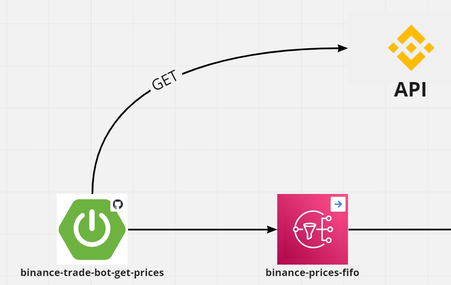

# binance-trade-bot-get-prices

## Introduction
This project has the objective to send request to the binance API, and publish is results in an AWS SNS topic.

## Technologies

- Java 11
- Spring
- AWS

## Get Started

Make sure to edit the properties file with a valid SNS arn.

Run the command

```
mvn clean install
```

Then start the application.